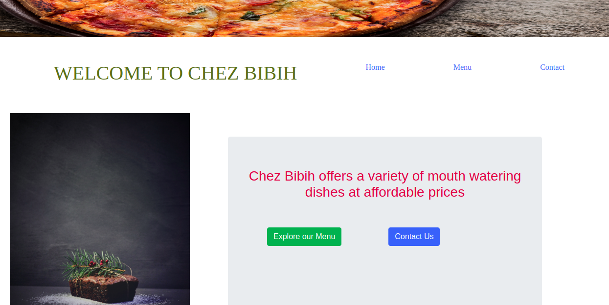

# Restaurant Page
The main purpose of this project is to make a restaurant page using Javascript. The content on the page have been laid out  strictly  using javascript modules.

## Live Demo Link

[Live Demo Link](https://raw.githack.com/Datagirlcmr/Restaurant-Page/development/dist/index.html)

=======

## Live Version

## Features

A stationary page that displays details of a restaurant, its menu and the contact

## Built With

- CSS, Bootstrap, Javascript
- Webpack for bundling
- Vscode for coding
- ESLint for Validation

For more information, see the
[*The Odin Project*](https://www.theodinproject.com/courses/javascript/lessons/restaurant-page).

## Author

👤 **Selma Ndi**

- Github: [@githubhandle](https://github.com/Datagirlcmr)
- Twitter: [@twitterhandle](https://twitter.com/SelmaNdi)
- Linkedin: [linkedin](https://www.linkedin.com/in/selma-ndi-datagirl-imba-8976ab32/)

Contributions, issues and feature requests are welcome! 

Feel free to check the [issues page](https://github.com/Datagirlcmr/Restaurant-Page/issues).
